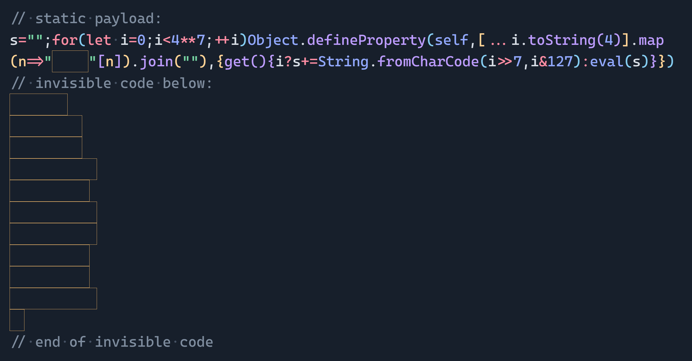

# Invisible JavaScript

Execute invisible JavaScript by abusing Hangul filler characters. Inspired by [Martin Kleppe](https://x.com/aemkei)'s [INVISIBLE.js](https://aem1k.com/invisible/).

[benjaminaster.com/invisible-javascript](https://benjaminaster.com/invisible-javascript/)

The following code executes `console.log("Hello")`:

